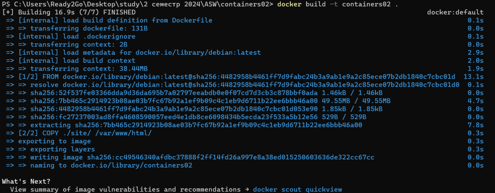
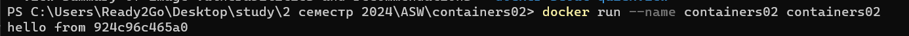
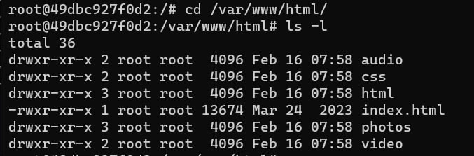

# Лабораторная работа №2 : Первый контейнер
## Цель работы
Данная лабораторная работа знакомит с основами контейнеризации и подготавливает рабочее место для выполнения следующих лабораторных работ.

## Задание
1. Установить Docker Desktop и проверить его работоспособность.
2. Создайте репозиторий containers02 и склонируйте его себе на компьютер.  
3. Создайте в папке containers02 файл Dockerfile с указанным содержимым.  
4. В той же папке проекта создайте папку site. В новой папке создайте файл index.html с произвольным содержимым.  
5. Запустить и протестировать контейнер.

## 1. Сколько времени создавался образ?
По скриншоту ниже видно , что образ создавался 16.9 секунд

## 2. Что было выведено в консоли?
В консоли выводится сообщение `hello from <hostname>` .  
924924c96c465a0 - название моего хоста, соответственно.

## 3. Что выводится на экране?
Вывод команды `ls -l` предоставляет информацию о содержимом директории `/var/www/html/` внутри контейнера Docker, включая права доступа, владельца, размер и дату изменения файлов и директорий.  

## Выводы
Docker позволяет упаковывать приложения в контейнеры, которые легко переносить и запускать на разных компьютерах без проблем с зависимостями.   
Данная лабораторная работа позволила мне познакомиться с основными принципами Docker и создать первый контейнер. Также подготовлено рабочее место для выполнения следующих лабораторных работ.

## Используемые источники
1. Руководство по Docker : https://techrocks.ru/2021/10/17/beginners-guide-to-docker/